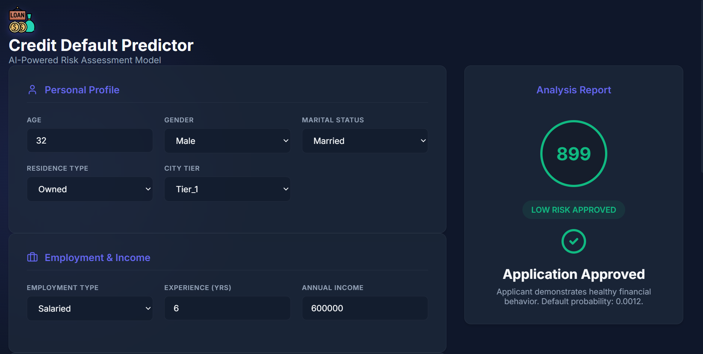

# 🚀 Credit Default Predictor

### 🔍 Predict Credit Default Risk Using Machine Learning

🌐 **Live Application (Vercel)**
👉 **[https://credit-default-predictor.vercel.app/](https://credit-default-predictor.vercel.app/)**

---

## 🎥 Demo

<p align="center">
  
</p>

---

## 🧠 What is this project?

**Credit Default Predictor** is a **full-stack machine learning web application** that predicts whether a customer is likely to **default on credit payments**.

The project is designed to **simulate real-world credit risk assessment systems** used by banks and financial institutions, combining:

* A **robust ML classification model**
* A **FastAPI-powered backend**
* A **modern React (Vite) frontend**
* **Cloud deployment** with Docker support

The goal is to provide **fast, interpretable, and production-ready credit risk predictions**.

---

## ✨ Key Features

* 🏦 **Credit default risk prediction**
* 🤖 **Machine Learning–powered classification**
* ⚡ **Real-time prediction via REST API**
* 🖥️ **Modern React + Vite frontend**
* 🔗 **Frontend–backend integration**
* 🐳 **Dockerized backend**
* ☁️ **Cloud-deployed frontend**
* 📱 **Responsive UI**
* 🧩 **Clean, modular project structure**

---

## 🛠️ Tech Stack

### Frontend <p>     </p> 
### Backend & ML <p>      </p> 
### Tools & Platform <p>    </p>

---

## 📊 Problem Statement

Financial institutions face significant losses due to **loan defaults**.
Manual evaluation is slow, inconsistent, and prone to bias.

This project solves that by:

* Using **historical customer data**
* Applying **machine learning classification**
* Producing **instant credit risk predictions**

---

## 🧠 Modeling Approach

* Supervised **classification model**
* Trained on structured credit data
* Outputs a **binary prediction**:

  * `0` → No Default
  * `1` → Likely Default

The model is optimized for:

* Accuracy
* Generalization
* Real-time inference

---


## 📂 Project Structure

```text
credit-default-predictor/
│
├── app/
│   ├── main.py
│   ├── model.pkl
│   ├── requirements.txt
│   └── Dockerfile
│
├── frontend/
│   └── credit-default-predictor/
│       ├── public/
│       ├── src/
│       ├── index.html
│       ├── package.json
│       ├── package-lock.json
│       ├── vite.config.js
│       └── eslint.config.js
│
├── Demo.png
├── README.md
├── LICENSE
└── .gitignore
```

---

## ⚙️ Run Locally

### Backend (FastAPI)

```bash
cd app
pip install -r requirements.txt
uvicorn main:app --reload
```

### Frontend (React + Vite)

```bash
cd frontend/credit-default-predictor
npm install
npm run dev
```

---

## 🐳 Run with Docker

```bash
docker build -t credit-default-predictor .
docker run -p 8000:8000 credit-default-predictor
```

---

## 🎯 Use Cases

* Bank loan approval systems
* Credit risk assessment
* Financial decision support tools
* FinTech applications
* ML portfolio projects

---

## 📄 License

This project is licensed under the **MIT License**.

---

### ⭐ If you find this project useful, give it a star — it really helps!
